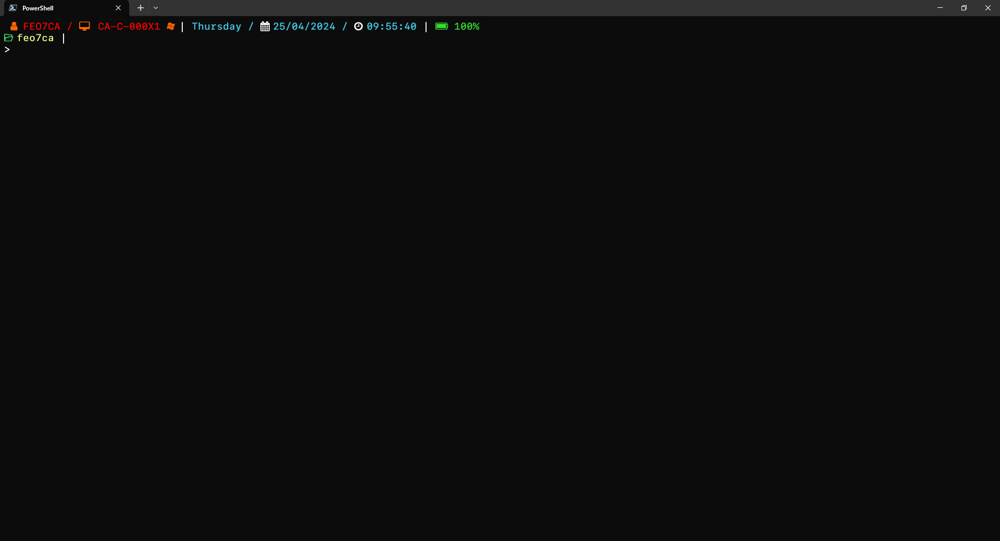
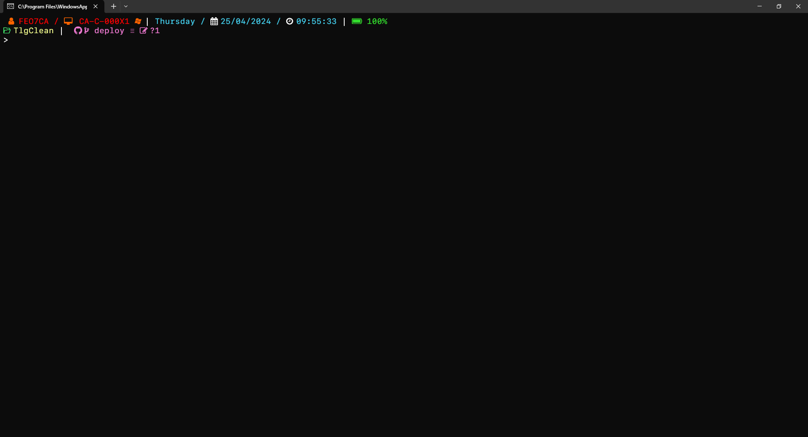
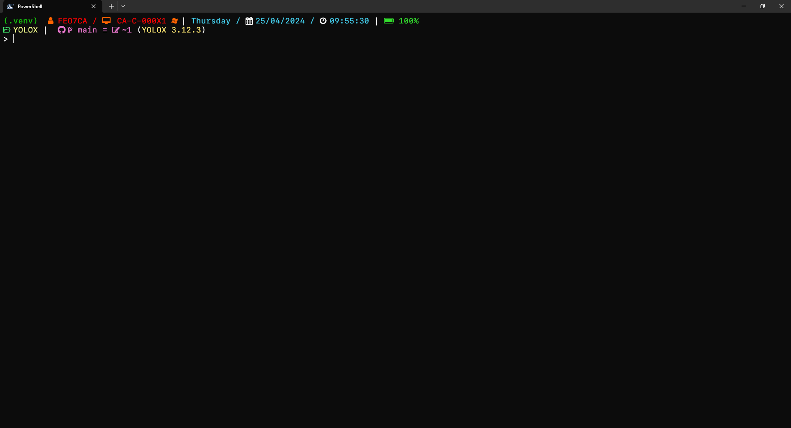

# TlgClean
My Oh My Posh Theme

## How to install:
To install this theme, you should have the [Oh My Posh](https://ohmyposh.dev/) installed.

After installing, add this "tlg_clean.omp.json" file in the themes folder where the package was installed.

## Demo:
### Default:

### With ".git" folder:

### With a especial environment:

